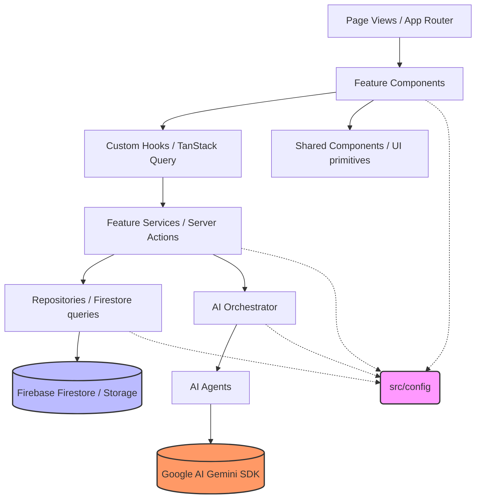

# CivicMind Architecture Blueprint & Review
**Author:** Principal Software Architect, Google  
**Status:** Approved for Implementation  
**Target Stack:** Next.js 15 (App Router), TypeScript, Tailwind CSS v4, shadcn/ui, Firebase, Google AI (Gemini), TanStack Query

---

## 1. Final Recommended Folder Tree

This structure enhances the initial project setup to optimize for strict feature isolation, clean dependency flows, design token centralization, and testability, while remaining easy to use for a fast-paced development workflow.

```text
/src
├── assets/                       # Global assets (images, icons, etc.)
│   ├── icons/                    # Custom SVG and icon assets
│   ├── images/                   # Static raster images (png, jpg)
│   ├── illustrations/            # Vector illustrations for landing pages
│   └── animations/               # Lottie or JSON transition animations
│
├── config/                       # Application configuration layer (Only source of truth for SDKs/Env)
│   ├── app.ts                    # Global application metadata (URL, Name, Versions)
│   ├── env.ts                    # Zod schema checks validating all process.env variables at bootup
│   ├── firebase.ts               # Firebase Client App credentials configurations
│   ├── gemini.ts                 # Google AI SDK model configurations (server-only key loading)
│   ├── maps.ts                   # Google Maps Platform configuration (key, dynamic libraries)
│   └── query.ts                  # React Query Client default caching and staleTime configurations
│
├── providers/                    # Global React context wrappers
│   ├── auth-provider.tsx         # Firebase Auth status listener and user context mapping
│   ├── query-provider.tsx        # TanStack Query Client provider wrapper
│   ├── theme-provider.tsx        # Theme state provider (toggles dark mode class)
│   └── maps-provider.tsx         # Lazy-loader context for the Google Maps JavaScript API
│
├── theme/                        # Design Token System (Single source of truth for styles)
│   ├── colors.ts                 # Color palette tokens (HSL values mapped to Tailwind variables)
│   ├── spacing.ts                # Padding, margin, gap, and height layout tokens
│   ├── typography.ts             # Font families, sizes, line heights, and weights
│   ├── radius.ts                 # Border radius tokens matching shadcn specifications
│   ├── shadows.ts                # Elevation levels and glow shadows
│   ├── animations.ts             # Framer motion transition presets and keyframe configs
│   └── index.ts                  # Combined export entry point for Tailwind theme config injection
│
├── components/                   # Shared presentation components (feature-agnostic UI)
│   ├── ui/                       # shadcn/ui primitives (e.g. button.tsx, dialog.tsx, input.tsx)
│   ├── shared/                   # Global reusable elements (e.g. header-navbar.tsx, sidebar-nav.tsx)
│   ├── layout/                   # Structural layouts (e.g. grid-system.tsx, container-box.tsx)
│   ├── feedback/                 # User feedback elements (e.g. spinner.tsx, status-toast.tsx, alert-banner.tsx)
│   └── map/                      # Shared Maps visuals (e.g. map-container.tsx, map-advanced-marker.tsx)
│
├── features/                     # Feature-Driven isolated modules (Core business domains)
│   ├── auth/                     # Authentication & onboarding flows
│   ├── dashboard/                # Central data dashboard and maps view
│   ├── reports/                  # Civic incident reporting & dispatch tracking
│   ├── community/                # Forums, local threads, upvotes, and events
│   ├── officer/                  # Field worker task dispatch interface
│   └── admin/                    # System auditing and manual routing override board
│       # Inside EVERY feature directory:
│       ├── components/           # Feature-specific components (e.g. report-card.tsx)
│       ├── hooks/                # Feature-specific hooks (e.g. use-reports.ts)
│       ├── services/             # API request wrappers and handlers
│       ├── repositories/         # Direct Firestore collection operations (e.g. report.repository.ts)
│       ├── schemas/              # Zod validation structures (e.g. report.schema.ts)
│       ├── actions/              # Server Actions for form submissions and modifications
│       ├── constants/            # Feature-specific static configs
│       ├── types/                # Feature-specific Type definitions
│       ├── utils/                # Feature-specific helper files
│       └── README.md             # Self-contained documentation for the feature
│
├── ai/                           # Dedicated Artificial Intelligence Layer
│   ├── agents/                   # Individual agents (e.g. classification-agent.ts, urgency-agent.ts)
│   ├── orchestrator/             # Coordinator processing pipeline (agent-orchestrator.ts)
│   ├── prompts/                  # Prompt templates and context builders (prompt-templates.ts)
│   ├── parser/                   # Markdown cleaning and structural object parsers (response-parser.ts)
│   ├── decision-engine/          # Rules-based escalation engines (dispatch-rules.ts)
│   ├── types/                    # Input, output, and system configuration types
│   └── utils/                    # Utility helpers (safety evaluation, log wrappers)
│
├── hooks/                        # Feature-agnostic, global custom React hooks
│   ├── use-mounted.ts            # Client-side mount checking hook (prevents SSR hydration warnings)
│   ├── use-local-storage.ts      # Type-safe local storage sync hook
│   └── use-debounce.ts           # Input search delay optimizer hook
│
├── lib/                          # Third-party wrappers and shared service initializations
│   └── logger.ts                 # Production-grade centralized logging client
│
├── types/                        # Core shared TypeScript declarations
│   ├── api.ts                    # General REST API / Response contracts
│   ├── auth.ts                   # Session and token state definitions
│   ├── report.ts                 # Civic report and coordinates contracts
│   ├── ai.ts                     # Multi-agent output models
│   ├── common.ts                 # Coordinates, pagination, and shared layout contracts
│   └── user.ts                   # User profiles and user role definitions
│
├── constants/                    # Application-wide static lookup tables
│   ├── routes.ts                 # Typed navigation router maps (dashboard, auth paths)
│   ├── roles.ts                  # Security access level indicators (citizen, officer, admin)
│   ├── departments.ts            # Official municipal division listings
│   ├── issue-status.ts           # State mapping parameters (submitted, in-progress, resolved)
│   ├── storage.ts                # Storage directory pathways (avatars, report-media)
│   └── app.ts                    # Global application metadata (branding names, contact addresses)
│
├── utils/                        # Global reusable helper functions
│   ├── cn.ts                     # ClassName conditional merger (clsx + tailwind-merge)
│   ├── date.ts                   # Relative date and calendar layout formatters
│   ├── error.ts                  # AppError class and custom Firebase/Gemini message parsers
│   └── format.ts                 # Number, currency, and string truncation utilities
│
└── app/                          # Routing structure (Next.js 15 App Router - Presentational Only)
    ├── layout.tsx                # Base HTML Shell, Fonts, and global CSS import
    ├── page.tsx                  # Home Landing page
    ├── (auth)/                   # Authentication route group (Login, Sign-Up)
    ├── (dashboard)/              # Secure user dashboard group (Maps, Feed)
    └── api/                      # Backend Server API routes
```

---

## 2. Explanation for Every Major Folder

| Major Directory | Primary Responsibility |
| :--- | :--- |
| `src/assets` | Static visual assets (illustrations, dynamic SVG icons, loaders) separated from public builds to optimize image processing pipelines. |
| `src/config` | **System core boundary**. Loads configuration files from environment variables, verifies keys using Zod schemas at boot, and instantiates SDK settings. No raw `process.env` imports should exist outside this directory. |
| `src/providers` | Houses global React Context wrappers (Theme toggles, React Query providers, Auth state monitors) to avoid cluttering `layout.tsx` files. |
| `src/theme` | Centralized design tokens (colors, margins, font sizing). Serves as a single source of truth to customize Tailwind CSS v4 variables, preventing magic layout numbers and visual inconsistencies. |
| `src/components` | Houses pure presentation items. Divided into `ui/` (shadcn atomic primitives), `layout/` (grid boxes), `feedback/` (loaders/alerts), and `shared/` (navbar/sidebar panels). |
| `src/features` | **Domain Modules**. Follows encapsulation rules: every domain (e.g. `reports`) has its own UI, data queries (`repositories`), validation rules (`schemas`), hooks, and actions. |
| `src/ai` | Encapsulates the cognitive features. Contains independent generative agents, systemic prompts, structural parsers, and the orchestrator coordinating task flows. |
| `src/hooks` | Feature-agnostic global React hooks (hydration checks, debouncing) used across components. |
| `src/lib` | Client initializations and utilities. Houses the custom `logger.ts` which encapsulates logging levels and overrides standard browser outputs. |
| `src/types` | Shared type declarations categorized by business domain (`auth`, `report`, `user`) to enhance readability. |
| `src/constants` | Shared application lookup dictionaries (routing arrays, role maps, status arrays) to secure codebase string values. |
| `src/utils` | Pure utility functions (Tailwind class mergers, standard string truncation helpers, date math) free of application state. |
| `src/app` | Page layout, view coordination, and API routing. App router folders contain only views and layouts; all logic resides inside `/features`. |

---

## 3. Dependency Flow Diagram

The diagram below defines the strict layering. Dependencies must flow downward. High-level layers (Views/UI) may never directly import from database drivers, nor should lower-level data layers know anything about the UI layer.



---

## 4. Architectural Rules

To maintain cleanliness and feature isolation as the application scales, the following boundaries are enforced via linting rules and developer guidelines:

1. **Feature Encapsulation (Sandboxing)**
   * Feature folders (e.g., `features/reports/`) are self-contained. 
   * A component in `features/reports/` is **forbidden** from directly importing components, hooks, or utils from `features/community/`. 
   * If logic is shared, it must be promoted to the global `/components`, `/hooks`, `/utils`, or `/types` directory.
2. **Data Isolation (Repository Pattern)**
   * React components are strictly prohibited from directly calling Firestore operations (`getDoc`, `addDoc`, `collection`).
   * Component elements trigger custom hooks which hook into TanStack Query.
   * TanStack Query triggers a Feature Service/Action, which requests data from a Feature Repository (e.g., `report.repository.ts`).
   * **Only Repositories communicate with Firestore.**
3. **AI Gateway Isolation**
   * No Gemini API or SDK variables are accessed from presentation templates.
   * UI components request analysis solely from the **AI Orchestrator** through server endpoints or actions.
   * The AI Orchestrator executes prompts and aggregates sub-agents to deliver a single parsed JSON result to the caller.
4. **Configuration Access**
   * Files must never import variables directly from `process.env`. All configuration properties must be read from the unified `src/config/` module.
   * `src/config/env.ts` performs run-time Zod validations to catch missing API credentials before boot.
5. **Naming Conventions**
   * All file names must be structured in **kebab-case** (e.g. `report-card.tsx`, `report.repository.ts`, `report.types.ts`).
   * PascalCase filenames are prohibited to avoid file-system casing conflict issues in cross-platform deployments.

---

## 5. Suggested Improvements

1. **Centralized Logging (`lib/logger.ts`)**
   * Replace all raw `console.log` statements with instances of our custom logger.
   * Implement log level thresholds (`DEBUG`, `INFO`, `WARNING`, `ERROR`, `CRITICAL`) using environments to filter debug logs in production builds automatically.
2. **Module Alias Mapping**
   * Configure TypeScript path aliases inside `tsconfig.json` to prevent relative path nesting clutter:
     * `@/config/*` -> `src/config/*`
     * `@/providers/*` -> `src/providers/*`
     * `@/features/*` -> `src/features/*`
     * `@/theme/*` -> `src/theme/*`
3. **Zod Env Guarding**
   * Import `src/config/env.ts` in the main routing layouts or config initialization file to force key verification at server start. This prevents silent database connection failures when API keys are missing.
4. **Tailwind CSS v4 Token Mapping**
   * Map design tokens from `src/theme/` directly inside Tailwind's CSS theme definitions inside `src/styles/globals.css` using custom `@theme` tags, ensuring consistent layout parameters.
